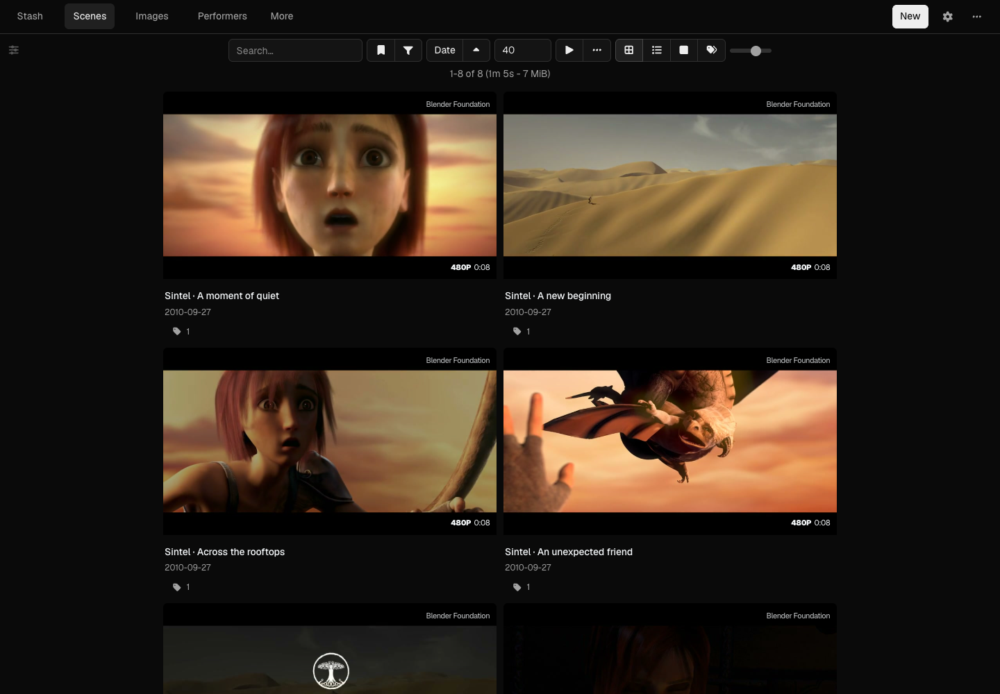
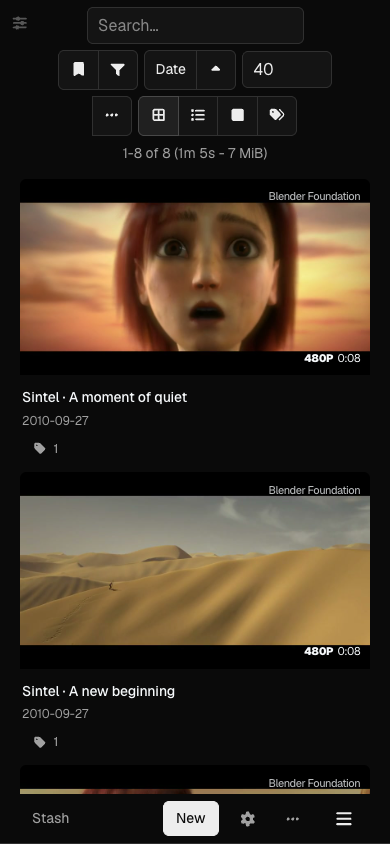

# Stash Minimal

A quiet, compact dark theme for Stash, inspired by [Vercel Geist](https://vercel.com/geist/introduction).

Neutral surfaces, restrained borders, and locally bundled Geist Sans. Thumbnails carry the scene grid; menus, inputs, dialogs, and settings share the same design.

The plugin also changes the native interface through Stash's React plugin API:

- Scenes, Images, and Performers stay in the main navigation. Other library pages move into **More**.
- Settings and other plugins stay directly accessible. Statistics, Help, Donate, and Logout share a compact action menu.
- Scene details start collapsed, giving the video the full available width. The edge toggle brings the native details and editing tools back.
- Native routes, filtering, playback, keyboard shortcuts, and configured navigation choices stay intact.

The JavaScript uses Stash's existing React, Bootstrap components, and icons. No extra framework, external font requests, or separate server.




## Install

Tested with Stash v0.31.1.

1. Open **Settings → Plugins → Available Plugins → Add Source**.
2. Name it **Stash Minimal** and use this source URL:

   ```text
   https://quietframe-player.github.io/stash-minimal/index.yml
   ```

3. Install **Stash Minimal**.
4. Disable other theme plugins and reload Stash. Other plugins can remain enabled.

To restore the previous appearance, disable Stash Minimal and re-enable your previous theme. Native Interface custom CSS still takes precedence; remove conflicting overrides there if needed.

For a scripted installation, preview first:

```sh
python3 -B scripts/install.py --url https://your-stash.example
```

Add `--apply` to install and enable. Add `--disable-theme Theme-ModernDark` to disable that installed theme in the same operation. Authentication uses `STASH_API_KEY` from the environment when required.

## Develop

Edit `plugins/stash-minimal/minimal.css` and `minimal.js`. The JavaScript changes native React markup and state through documented component patches. Build the deterministic package and install source:

```sh
python3 -B scripts/build.py
```

Run real-Stash checks in Chrome and WebKit, including the scene grid, detail page, menus, settings, keyboard focus, and mobile layout:

```sh
python3 -B scripts/integration.py --apply
```

This starts and removes its own isolated Docker container. It uses a checksum-pinned public Sintel trailer; it never connects to your library. Pass `--update-screenshots` to refresh the documentation images from this fixture.

The theme is MIT licensed. Geist Sans is bundled under the SIL Open Font License; see [font provenance](FONT_SOURCE.md). Screenshot footage is [Sintel](https://durian.blender.org/), © Blender Foundation, [CC BY 3.0](https://creativecommons.org/licenses/by/3.0/). This is an independent theme, unaffiliated with Vercel.
